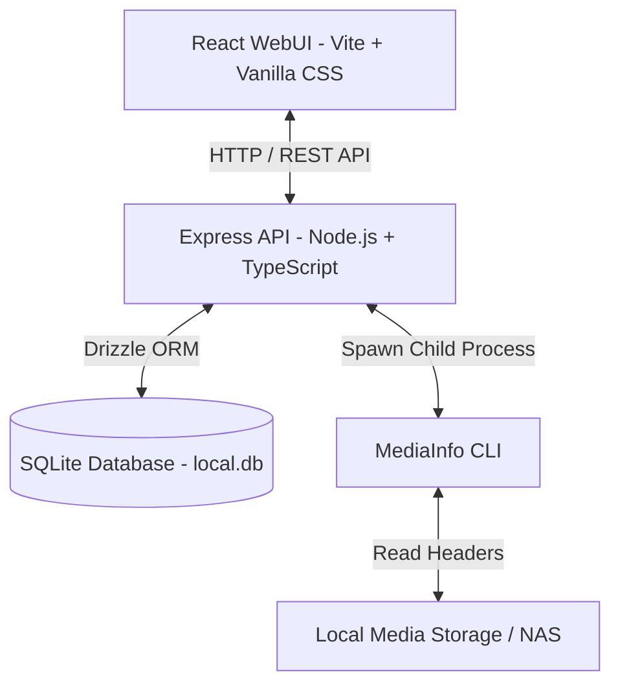
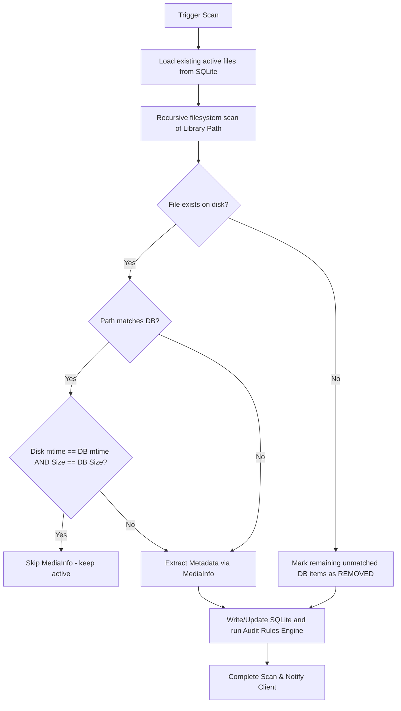

# TrackManager - Technical Specification

TrackManager is a 100% self-hosted, local media library auditor web application designed to scan Plex-organized media folders, extract rich structural metadata (container, video, audio, subtitles) using MediaInfo, and audit them against custom user-defined compliance rules (e.g., "Must have English subtitles in SRT format").

This document defines the architectural blueprints, database schema, rules engine design, scanning algorithms, UI layout strategy, and containerization setup.

---

## 1. Technology Stack

TrackManager is built using a decoupled architecture, allowing both a modern WebUI and future mobile clients to communicate with a unified TypeScript API.



### Backend API
*   **Runtime:** Node.js (TypeScript)
*   **Framework:** Express.js (decoupled, lightweight, robust routing)
*   **Database Tooling:** Drizzle ORM (type-safe, ultra-lightweight, direct SQL maps)
*   **Database Engine:** SQLite (single-file local database, perfect for self-hosting)
*   **Metadata Parser:** MediaInfo CLI (invoked via `child_process.exec` or `spawn` parsing headers in milliseconds, outputting rich JSON)

### Frontend WebUI
*   **Framework:** React (Vite)
*   **Styling:** Vanilla CSS (premium custom designs with CSS variables, modern grid/flex layouts, glassmorphism filters, smooth CSS transitions, and Outfits/Inter typography)
*   **State Management:** React Context / Custom Hooks (lightweight, zero external dependency overhead)

---

## 2. Precise Database Schema

Using Drizzle ORM syntax, the schema maps out Libraries, Media Items, Audio/Subtitle tracks, Rules, and Audit results.

```typescript
import { sqliteTable, text, integer, unique } from 'drizzle-orm/sqlite-core';

// 1. Libraries (Plex-style Library paths)
export const libraries = sqliteTable('libraries', {
  id: integer('id').primaryKey({ autoIncrement: true }),
  name: text('name').notNull(),
  path: text('path').notNull().unique(), // e.g., /media/movies
  type: text('type').notNull(), // 'movie' | 'tv'
  createdAt: integer('created_at', { mode: 'timestamp' }).notNull(),
  updatedAt: integer('updated_at', { mode: 'timestamp' }).notNull(),
});

// 2. Media Items (Movies and Episodes)
export const mediaItems = sqliteTable('media_items', {
  id: integer('id').primaryKey({ autoIncrement: true }),
  libraryId: integer('library_id')
    .notNull()
    .references(() => libraries.id, { onDelete: 'cascade' }),
  filePath: text('file_path').notNull().unique(), // Absolute path on host/container
  fileName: text('file_name').notNull(),
  fileSize: integer('file_size').notNull(), // in bytes
  mtimeMs: integer('mtime_ms').notNull(), // for change detection
  status: text('status').notNull(), // 'active' | 'removed'
  scannedAt: integer('scanned_at', { mode: 'timestamp' }).notNull(),
  removedAt: integer('removed_at', { mode: 'timestamp' }), // Track history
  
  // Parsed general metadata
  title: text('title'), // Media Title (from metadata or filename)
  season: integer('season'), // TV Shows only
  episode: integer('episode'), // TV Shows only
  container: text('container').notNull(), // e.g. mkv, mp4
  
  // Parsed Video metadata
  videoResolution: text('video_resolution'), // e.g. 3840x2160, 1920x1080
  videoBitrate: integer('video_bitrate'), // in bps
  videoCodec: text('video_codec'), // e.g. HEVC, AVC, AV1
  videoColorDepth: integer('video_color_depth'), // e.g. 8, 10, 12
  videoHdrFormat: text('video_hdr_format'), // e.g. HDR10, Dolby Vision, SDR
  
  // Raw JSON dump for safety/futureproofing
  rawMetadata: text('raw_metadata').notNull(), 
  
  createdAt: integer('created_at', { mode: 'timestamp' }).notNull(),
  updatedAt: integer('updated_at', { mode: 'timestamp' }).notNull(),
});

// 3. Audio Tracks
export const audioTracks = sqliteTable('audio_tracks', {
  id: integer('id').primaryKey({ autoIncrement: true }),
  mediaItemId: integer('media_item_id')
    .notNull()
    .references(() => mediaItems.id, { onDelete: 'cascade' }),
  trackIndex: integer('track_index').notNull(),
  language: text('language'), // ISO 639-2 or full name, e.g., 'eng', 'ger'
  format: text('format').notNull(), // e.g. 'DTS', 'Dolby TrueHD', 'AAC', 'AC-3'
  channels: integer('channels'), // e.g. 2, 6, 8
  bitrate: integer('bitrate'), // in bps
  isDefault: integer('is_default', { mode: 'boolean' }).notNull().default(false),
  isForced: integer('is_forced', { mode: 'boolean' }).notNull().default(false),
});

// 4. Subtitle Tracks
export const subtitleTracks = sqliteTable('subtitle_tracks', {
  id: integer('id').primaryKey({ autoIncrement: true }),
  mediaItemId: integer('media_item_id')
    .notNull()
    .references(() => mediaItems.id, { onDelete: 'cascade' }),
  trackIndex: integer('track_index').notNull(),
  language: text('language'), // e.g. 'eng', 'ger'
  format: text('format').notNull(), // e.g. 'SRT', 'PGS', 'ASS', 'VobSub'
  isDefault: integer('is_default', { mode: 'boolean' }).notNull().default(false),
  isForced: integer('is_forced', { mode: 'boolean' }).notNull().default(false),
  isHearingImpaired: integer('is_hearing_impaired', { mode: 'boolean' }).notNull().default(false), // SDH
});

// 5. Compliance Rules
export const rules = sqliteTable('rules', {
  id: integer('id').primaryKey({ autoIncrement: true }),
  name: text('name').notNull(),
  description: text('description'),
  isActive: integer('is_active', { mode: 'boolean' }).notNull().default(true),
  targetType: text('target_type').notNull(), // 'movie' | 'tv' | 'all'
  conditions: text('conditions').notNull(), // JSON string representing the conditions AST
  createdAt: integer('created_at', { mode: 'timestamp' }).notNull(),
  updatedAt: integer('updated_at', { mode: 'timestamp' }).notNull(),
});

// 6. Audit Results (Compliance cache table)
export const auditResults = sqliteTable('audit_results', {
  mediaItemId: integer('media_item_id')
    .notNull()
    .references(() => mediaItems.id, { onDelete: 'cascade' }),
  ruleId: integer('rule_id')
    .notNull()
    .references(() => rules.id, { onDelete: 'cascade' }),
  passed: integer('passed', { mode: 'boolean' }).notNull(),
  errorMessage: text('error_message'), // Explains failure: e.g. "Missing German Audio track"
  auditedAt: integer('audited_at', { mode: 'timestamp' }).notNull(),
}, (table) => ({
  pk: unique().on(table.mediaItemId, table.ruleId),
}));
```

---

## 3. Auditing Rules Engine Specification

Rules are saved in the database as a hierarchical AST in a JSON string. The rules engine executes this AST against a `MediaItem` (joined with its `audioTracks` and `subtitleTracks`).

### Rules JSON Structure
A rule contains a logical operator (`AND` or `OR`) and an array of sub-conditions.

```json
{
  "logicalOperator": "AND",
  "conditions": [
    {
      "field": "videoHdrFormat",
      "operator": "CONTAINS",
      "value": "Dolby Vision"
    },
    {
      "field": "subtitles",
      "operator": "HAS_SUBTITLE",
      "params": {
        "language": "eng",
        "format": ["SRT", "ASS"]
      }
    },
    {
      "field": "audio",
      "operator": "HAS_AUDIO",
      "params": {
        "language": "ger",
        "format": ["DTS", "Dolby TrueHD"]
      }
    }
  ]
}
```

### Supported Rule Fields and Operators

1.  **Direct Media Fields (`container`, `videoResolution`, `videoCodec`, `videoColorDepth`, `videoHdrFormat`)**
    *   `EQUALS`: Exact match.
    *   `CONTAINS`: Substring match (case-insensitive).
    *   `IN`: Checks if field value exists in a provided string list.
    *   `GTE` / `LTE`: Greater-than-or-equal / Less-than-or-equal (e.g. `videoColorDepth GTE 10`).

2.  **Audio Subcondition (`audio`)**
    *   `HAS_AUDIO`: Matches if **any** audio track fits the criteria:
        *   `language`: ISO 3-letter code (or `undefined` for untagged), or list of languages.
        *   `format` (optional list): e.g. `["DTS", "Dolby TrueHD"]`.
        *   `channels` (optional comparison): e.g. `GTE 6` (for 5.1/7.1 audio formats).

3.  **Subtitle Subcondition (`subtitles`)**
    *   `HAS_SUBTITLE`: Matches if **any** subtitle track fits the criteria:
        *   `language`: ISO 3-letter code.
        *   `format` (optional list): e.g. `["SRT", "ASS", "PGS"]`.
        *   `isForced` (optional boolean).
        *   `isHearingImpaired` (optional boolean).

---

## 4. Media Library Scan and Change Detection Algorithm

Scanning is designed to be highly optimal, running in **$O(N)$** space-efficient cycles. It executes fully in the background via incremental discovery to prevent thread locking.



### Step 1: Incremental Check
For every file located in the target directory:
1.  Verify the file extension is a video container (e.g., `.mkv`, `.mp4`, `.avi`, `.m4v`).
2.  Lookup the file path in the SQLite database.
3.  If a match is found **AND** the file's modification time (`mtimeMs`) and `fileSize` match the record, skip parsing (Zero I/O overhead).
4.  If a match is found but `mtimeMs` or `fileSize` has changed, mark the file for re-parsing.
5.  If no match is found, mark the file as a new addition.

### Step 2: MediaInfo Extraction
When parsing a file:
1.  Run the CLI command:
    ```bash
    mediainfo --Output=JSON "/absolute/path/to/media/file.mkv"
    ```
2.  Parse the JSON output. Extract:
    *   **General Track:** Container format, duration, bitrate, overall properties.
    *   **Video Track:** Resolution (width x height), codec, bitrate, color depth (e.g. `10` for 10-bit), HDR formats (scanned from commercial name / HDR format profile fields like `Dolby Vision`, `HDR10`, `HLG`).
    *   **Audio Tracks:** Format (TrueHD, DTS, AAC), Channels (2, 6, 8), Language (ISO code), Default/Forced states.
    *   **Subtitle Tracks:** Format (SRT, PGS, ASS), Language, Default/Forced/SDH states.
3.  Write everything to the database in a transaction.

### Step 3: Removal Handling
Any file recorded as `active` in the database for the given library that was **not** discovered during the current scan is flagged as `removed` with `status = 'removed'` and `removedAt = NOW()`. This ensures the item is completely visible in the "Removed/History" dashboard without deleting audits.

---

## 5. UI Layout Strategy & Premium Sleek Aesthetics

To achieve a **wow-factor, state-of-the-art user experience**, TrackManager employs a highly custom, dark-mode-first, frosted glassmorphism interface. The layout is built from the ground up to feel extremely premium, responsive, and tactile.

### The Sleek Design System

*   **Harmony Palette:**
    *   *Canvas Background:* Deep void-slate (`#060913` to `#0d1326` gradient) for a modern immersive backdrop.
    *   *Glass Panels:* Frosted semi-translucent slate (`rgba(13, 20, 38, 0.45)`) backed by heavy blurring (`backdrop-filter: blur(20px) saturate(180%)`) and defined by thin, glowing borders (`border: 1px solid rgba(255, 255, 255, 0.08)`).
    *   *Core Accents:* Electric cyan (`#00f2fe`) and neon amethyst (`#9b51e0`) mixed in smooth gradients for highlights, primary call-to-actions, and progress indicators.
    *   *Status Badges:* Sleek custom pill badges with low-opacity fills and matching bright text, completely avoiding generic flat colors:
        *   *Passed:* Emerald glow (`rgba(16, 185, 129, 0.15)` fill with `#10b981` text).
        *   *Failed:* Amaranth crimson (`rgba(239, 68, 68, 0.15)` fill with `#ef4444` text).
        *   *Historical/Removed:* Golden copper (`rgba(245, 158, 11, 0.15)` fill with `#f59e0b` text).
*   **Typography:** Google Font **Outfit** for sleek, geometric high-end headings (extremely clean, modern kerning) and **Inter** for dense, technically detailed metadata tables.
*   **Tactile Animations & Micro-interactions:**
    *   *Smooth Traces:* Soft scale-up triggers (`transform: scale(1.02)`) on cards with glowing border animations.
    *   *Active Scans:* A glowing, rotating dual-ring animation surrounding the "Scan Now" CTA when a background scan is active.
    *   *Data Transitions:* Soft layout entry animations (using CSS fade-in slide-up effects) that execute in less than 200ms for a highly responsive, snappy feel.

### Core View Layouts

1.  **Dashboard Overview (Analytical Hub):**
    *   *Compliance Indicator:* A massive, central radial progress gauge that glows with an emerald-to-cyan gradient reflecting the library's overall health score.
    *   *Visual Distribution Metrics:* Sleek, inline micro-bar charts showing the distribution of media files by Video Resolution (e.g., 4K vs 1080p), Container (MKV vs MP4), and Audio codec.
    *   *Active Library Cards:* Beautiful glassmorphic widgets for each library path, showing path strings, file counts, and a pulsing mini-indicator for scanning state.

2.  **Audit Center (Interactive High-Performance Grid):**
    *   *Multi-Dimensional Search & Filtering:* A dense, powerful toolbar with search inputs, multi-select dropdown filters (passed, failed, library path, video quality), and a quick-toggle for "Show failures only".
    *   *Sleek File Row Rows:* Modern layout containing horizontal flex items detailing the file name, file size, codec badges, and active failing rules. Rows failing compliance display an extremely thin, glowing crimson left-edge border rather than solid red fills.
    *   *Slide-Over Details Panel:* A smooth right-to-left sliding drawer. It displays detailed tracks (video depth, sub languages) grouped in sleek accordion panels, plus a togglable, fully-formatted syntax-highlighted **Raw JSON Code Viewer** with a one-click "Copy" button.

3.  **Auditing Rules Builder:**
    *   *Interactive AST Editor:* Rules are configured through an engaging, drag-free structural editor. Users add conditional clauses that visually connect using stylized node connectors (e.g., matching Plex's workflow).
    *   *Rule Cards:* Each active rule has its own card displaying statistics on how many files it is currently flagging, with a one-click "Test Rule" simulation button before saving.

4.  **Audit History & Removed Files:**
    *   *Ghost-File Tracker:* Dedicated view for removed media files. These entries have faded typography (`opacity: 0.6`) and special timeline badges representing when the file was detected as deleted, ensuring records are preserved for auditing without cluttering the active grid.

---

## 6. Dockerization Blueprint

To run seamlessly inside Docker, the container must package both Node.js and the `mediainfo` binary, running securely as a non-root user.

```dockerfile
# --- Base Stage for MediaInfo CLI ---
FROM alpine:3.19 AS base
RUN apk add --no-cache mediainfo nodejs npm tini

# --- Builder Stage ---
FROM base AS builder
WORKDIR /app
COPY package*.json ./
RUN npm ci
COPY . .
RUN npm run build

# --- Production Stage ---
FROM base AS runner
ENV NODE_ENV=production
WORKDIR /app

# Run as non-root user for security
RUN addgroup -g 10001 -S appgroup && \
    adduser -u 10000 -S appuser -G appgroup

COPY package*.json ./
RUN npm ci --only=production

# Copy built app
COPY --from=builder /app/dist ./dist
COPY --from=builder /app/drizzle ./drizzle

# Create persistent storage folder for SQLite database
RUN mkdir -p /app/data && chown -R appuser:appgroup /app

USER appuser
EXPOSE 3000

# Mount SQLite DB path and local media paths
VOLUME ["/app/data", "/media"]

ENTRYPOINT ["/sbin/tini", "--"]
CMD ["node", "dist/backend/index.js"]
```

---

## 7. Logging, Documentation, & Automated Testing

To ensure enterprise-grade reliability, ease of debugging, and long-term maintainability, TrackManager incorporates structured logging, dedicated documentation directories, and an automated testing suite designed for CI/CD integration.

### A. Structured Logging System
*   **Engine:** A centralized logging utility built with a high-performance structured logging architecture (e.g. using `pino` or a modern TypeScript logger).
*   **Log Levels:**
    *   `TRACE`: Exhaustive diagnostic details (e.g., individual file path walk events).
    *   `DEBUG`: System steps (e.g., database transaction states, media parsing output payloads).
    *   `INFO`: High-level operational checkpoints (e.g., scan start/finish statistics, active library status).
    *   `WARN`: Non-fatal issues (e.g., failed to parse a corrupted file, network share temporary delay).
    *   `ERROR`: Critical failures requiring intervention (e.g., DB lock, invalid permissions).
*   **Formatters:**
    *   *Development:* Human-readable, colorized terminal string format with timestamps.
    *   *Production (Docker/Host):* Single-line JSON strings to facilitate seamless parsing by indexing systems (e.g., Loki, Graylog, Datadog).
*   **Environment Configuration:** `LOG_LEVEL` env variable (e.g., `LOG_LEVEL=info` in production to fully suppress `debug`/`trace` verbosity).

### B. Dedicated Documentation Folder (`docs/`)
A root `docs/` folder contains comprehensive markdown references:
1.  `docs/API.md`: Detailed specifications of the decoupled REST API (endpoints, query parameters, request/response bodies, HTTP status codes, authorization schemas).
2.  `docs/DEVELOPMENT.md`: Roadmap for building, developing rules, extending Drizzle tables, and formatting the AST.
3.  `docs/DEPLOYMENT.md`: Step-by-step setup guides for standalone execution, Docker Compose orchestration, volume permissions, and performance tips.

### C. Automated Testing & CI/CD Pipeline
*   **Testing Suite:** Modern testing engine utilizing **Vitest** (extremely fast, zero-configuration TypeScript parser, 1:1 match with standard Vite tooling).
*   **Test Categories:**
    *   *Unit Tests:* High-coverage validations of the Rules Engine AST logic, language normalizers, and time difference evaluations.
    *   *Integration Tests:* Validations of the Express API route behaviors, SQLite transaction sequences, and crawl handlers using Mock FS frameworks.
*   **CI/CD Configuration:** A pre-configured GitHub Actions workflow (`.github/workflows/ci.yml`) validating all PRs and commits:
    ```yaml
    name: TrackManager CI
    on: [push, pull_request]
    jobs:
      verify:
        runs-on: ubuntu-latest
        steps:
          - uses: actions/checkout@v4
          - uses: actions/setup-node@v4
            with:
              node-version: 20
              cache: 'npm'
          - run: npm ci
          - run: npm run lint
          - run: npm run test
          - run: npm run build
    ```

---

## 8. Next Steps

1.  Create the workspace folder structure (`backend/`, `frontend/`, `shared/`, `docs/`).
2.  Initialize the Node + TypeScript environment on the backend.
3.  Set up Drizzle schemas and database connectors.
4.  Implement the structured Logger utility supporting dynamic `LOG_LEVEL` settings.
5.  Implement the MediaInfo integration layer and directory scanning routines.
6.  Set up the Express server with auditing rules evaluation.
7.  Build the automated test suites using Vitest for unit and integration sweeps.
8.  Draft the API and Deployment guides inside the `docs/` folder.
9.  Build the gorgeous React + Vite frontend dashboard using premium custom CSS styling.

